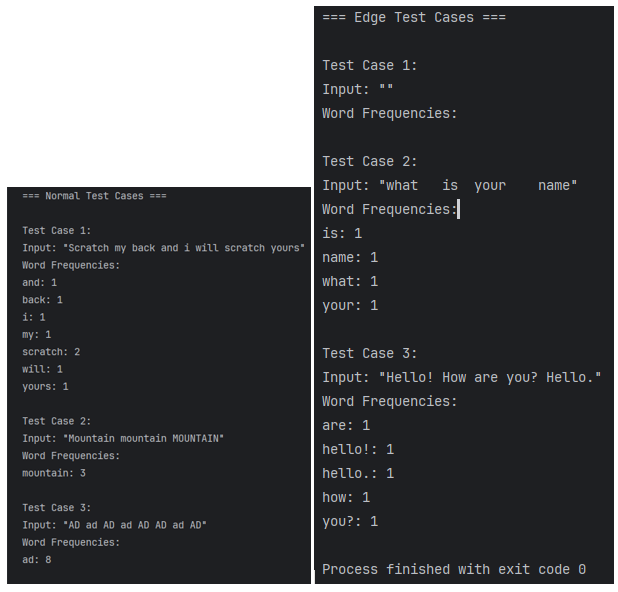

# Word Frequency Counter

This is a simpleJava program that calculates the frequency of each word in a given text using `HashMap` to store word frequencies & `TreeMap` to sort results alphabetically. The program includes pre-defined **normal** and **edge test cases** to demonstrate its functionality.

---

## Features

- **Normal Test Cases**:
    - Mixed words and spaces.
    - Case-insensitivity.
    - Repeated words.

- **Edge Test Cases**:
    - Empty input.
    - Multiple spaces.
    - Special characters.

- **Output**:
    - Displays each word and its frequency in alphabetical order.

---

## How to Run the Program

1. **Save the Program**:
    - Save the code in a file named `Main.java`.

2. **Compile the Program**:
    - Open a terminal or command prompt.
    - Navigate to the directory where the file is saved.
    - Run the following command to compile the program:
      ```bash
      javac WordFrequencyCounter.java
      ```

3. **Run the Program**:
    - After compiling, run the program using:
      ```bash
      java WordFrequencyCounter
      ```

4. **Observe the Output**:
    - The program will display the results for the pre-defined **normal** and **edge test cases**.

---

## Example Output

### Normal Test Cases